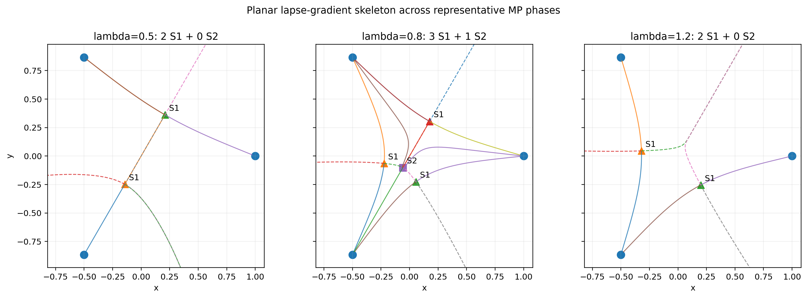
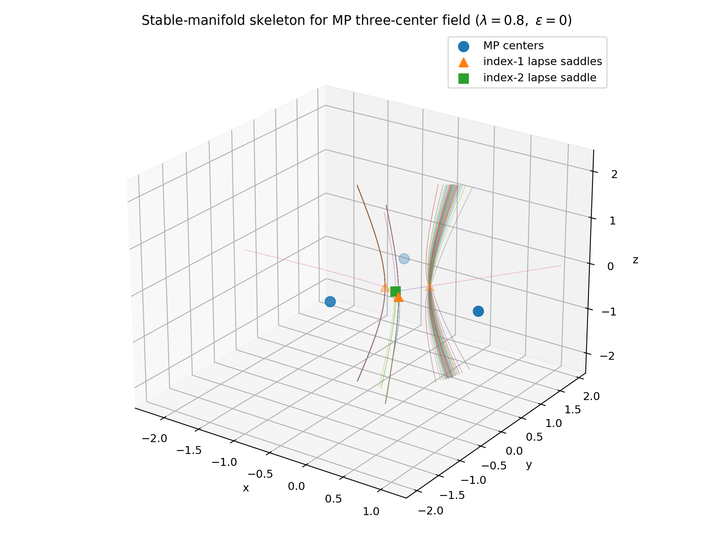
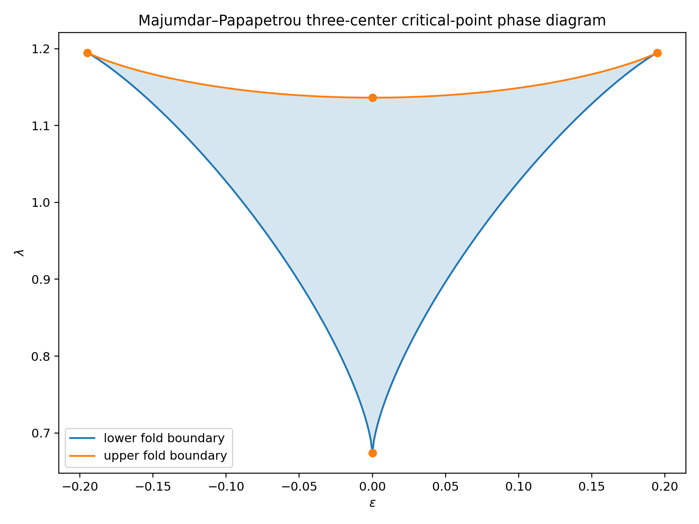

# Lapse-Gradient Topology of Static Multi-Black-Hole Spacetimes: Critical-Point Bifurcations in Majumdar-Papapetrou Geometry

## Abstract

This study treats the lapse function \(N=d\tau/dt\) of a static spacetime as a scalar field encoding gravitational redshift and the proper-acceleration structure of static observers, and proposes a gradient-topological framework for classifying the global organization of multi-source gravitational fields.

As an exact benchmark, we use Majumdar-Papapetrou (MP) multi-black-hole spacetimes, for which the lapse is determined by a harmonic function \(U\). We define a descriptor based on finite critical points of the lapse, their Morse indices, gradient separatrices, and heteroclinic structure.

For an equilateral three-center family with masses

$$
(M_1,M_2,M_3)=(1,1,\lambda),
$$

we identify two critical mass ratios,

$$
\lambda_-
=
0.673877474470738\ldots,
$$

and

$$
\lambda_+
=
1.136252210664681\ldots,
$$

at which the lapse critical-point structure bifurcates.

The first bifurcation is a symmetry-breaking pitchfork-type bifurcation and the second is a fold-type saddle-node annihilation. The finite critical structure changes as

$$
2S_1
\longrightarrow
3S_1+S_2
\longrightarrow
2S_1.
$$

These results are supported by analytic normal-form reduction, interval/Krawczyk root certification at representative parameter values, Brouwer-index consistency, and independent validated numerics using outward-rounded interval arithmetic and arbitrary-precision ball arithmetic.

In particular, complete critical sets and Morse indices are certified at \(\lambda=0.5\), \(0.8\), and \(1.2\). Local existence and uniqueness of the off-axis pitchfork branches and fold nondegeneracy are also certified.

For the asymmetric family

$$
(M_1,M_2,M_3)
=
(1+\varepsilon,1-\varepsilon,\lambda),
$$

we obtain a cusp unfolding with the scaling law

$$
\lambda_{\mathrm{fold}}(\varepsilon)-\lambda_-
\sim
C|\varepsilon|^{2/3},
\qquad
C=1.58535311676\ldots.
$$

Finally, we compare the proposed gradient-skeleton representation with contour/Reeb-type representations and argue that the distinguishing information is not level-set connectivity alone, but the combined organization of Morse indices, stable and unstable manifolds, and heteroclinic connections.

**Keywords:** lapse function, gravitational redshift, Majumdar-Papapetrou spacetime, Morse bifurcation, gradient skeleton, validated numerics, interval arithmetic, multi-black-hole topology

---


## 1. Introduction

Static gravitational fields admit a natural scalar description through the lapse function. For a static observer in a spacetime written as

$$
ds^2=-N^2c^2dt^2+h_{ij}dx^idx^j,
$$

the lapse gives the ratio between proper time and the coordinate time adapted to the static Killing field,

$$
N=\frac{d\tau}{dt}.
$$

It is therefore simultaneously a clock-rate field and a gravitational redshift factor. In stationary settings, closely related redshift potentials and their level sets have been used to define isochronometric surfaces and relativistic geoids [5,6]. In exact black-hole geometries, the lapse and its gradient have likewise been employed as simple invariant diagnostics of the gravitational field; in particular, Semerák and Basovník used the lapse and its gradient to study the geometry of a Majumdar-Papapetrou (MP) binary [4].

The present work focuses on a different aspect of the same scalar field: its critical-point and gradient-flow organization. The motivating question is whether the global structure of a static multi-source gravitational field can be characterized not only by lapse values or level surfaces, but also by the locations and Morse indices of finite critical points, together with their stable and unstable manifolds and the separatrix structure of the associated gradient flow.

Majumdar-Papapetrou spacetimes provide an exact setting in which this question becomes tractable. The MP class was introduced independently by Majumdar and Papapetrou [1,2] and interpreted as equilibrium configurations of extremally charged black holes by Hartle and Hawking [3]. In isotropic coordinates,

$$
ds^2
=
-U^{-2}dt^2
+
U^2d\mathbf{x}^2,
$$

with

$$
U(\mathbf{x})
=
1+\sum_a\frac{M_a}{|\mathbf{x}-\mathbf{x}_a|},
\qquad
N=U^{-1}.
$$

Consequently,

$$
\nabla N
=
-U^{-2}\nabla U,
$$

and the finite critical points of the lapse coincide exactly with the equilibrium points of the corresponding positive Coulomb potential. This observation places the mathematical core of the problem within the classical point-charge equilibrium literature associated with Maxwell's conjecture.

That literature is substantial. Gabrielov, Novikov, and Shapiro studied dimension-independent bounds for critical points of point-charge potentials and related the problem to Voronoi structures [7]. Tsai proved sharp results for special three-charge configurations, including the equilateral case, and later gave a rigorous classification for three equal-magnitude charges under positional variation using symbolic and exact integer computation [8,9]. Uteshev and Goncharova investigated stationary points and parameter-domain bifurcation pictures for positive Coulomb charges with fixed source positions [10]. These works make it clear that neither the equilateral three-charge problem, charge-ratio variation, nor equilibrium-point bifurcation is new in itself.

Accordingly, the contribution of the present paper is deliberately narrower. We restrict the previously studied equilateral charge-ratio parameter space to the physically distinguished MP mass-ratio section

$$
(M_1,M_2,M_3)=(1,1,\lambda),
$$

with the three centers fixed at the vertices of an equilateral triangle, and reinterpret this section as a family of relativistic lapse fields. For this slice we derive explicit closed-form intersections with the local degeneracy set, classify the corresponding three-dimensional lapse Morse indices, derive local pitchfork and fold normal forms, and analyze the symmetry-broken family

$$
(M_1,M_2,M_3)
=
(1+\varepsilon,1-\varepsilon,\lambda).
$$

The resulting cusp unfolding is compared directly with the full MP equations. The local bifurcation inequalities, representative root counts, Morse-index assignments, and cusp scaling are independently reproduced using outward-rounded interval arithmetic and arbitrary-precision ball arithmetic.

For organization and physical interpretation, we refer to the collection of lapse critical points, their Morse indices and critical values, invariant manifolds, heteroclinic connections, and basin information as the **gravitational gradient skeleton**. This term is not intended to define a new topological theory. Rather, it is a physics-specific descriptor built from standard Morse and gradient-flow data. In particular, it is conceptually close to the information encoded by a Morse-Smale complex [11], while differing from contour-tree and Reeb-type representations, which primarily summarize level-set connectivity [12].

The main results are:

1. two explicit critical mass ratios,

   $$
   \lambda_-
   =
   0.673877474470738\ldots,
   \qquad
   \lambda_+
   =
   1.136252210664681\ldots,
   $$

   at which the symmetric MP family undergoes local critical-point bifurcations;

2. a certified local transition

   $$
   S_1
   \longrightarrow
   S_2+2S_1
   $$

   at \(\lambda_-\), generated by a symmetry-breaking pitchfork;

3. a certified local transition

   $$
   S_1+S_2
   \longrightarrow
   \varnothing
   $$

   at \(\lambda_+\), generated by a fold;

4. complete, independently certified finite critical sets at the representative values

   $$
   \lambda=0.5,\quad 0.8,\quad 1.2,
   $$

   with structures

   $$
   2S_1,\qquad 3S_1+S_2,\qquad 2S_1;
   $$

5. an imperfect-pitchfork/cusp unfolding for

   $$
   (1+\varepsilon,1-\varepsilon,\lambda),
   $$

   with the asymptotic law

   $$
   \lambda_{\rm fold}(\varepsilon)-\lambda_-
   \sim
   C|\varepsilon|^{2/3},
   \qquad
   C=1.58535311676\ldots;
   $$

6. an explicit separation between what is fully certified and what remains open: the local bifurcations, representative phase completeness, and cusp scaling are certified, whereas a global exclusion of all off-axis degeneracies and both asymptotic parameter tails is not yet claimed.

This scope is intentionally conservative. The purpose is not to restate the classical Coulomb equilibrium problem in relativistic language, but to identify which additional structures become physically and mathematically useful when that problem is interpreted as the critical topology of a black-hole lapse field.


A particularly important distinction is between **equilibrium-count novelty** and **local-structure novelty**. The former is not claimed here: Tsai's \(1:s:t\) equilateral parameter plane already contains the present \(s=1,\ t=\lambda\) family. The latter is the focus of this paper: the explicit one-parameter degeneracy coordinates, their relativistic three-dimensional Morse interpretation, the local pitchfork/fold normal forms, the symmetry-breaking cusp coefficient, and the independent validated-numerics certificates.

---

## 2. Related Work and Positioning

### 2.1 Majumdar-Papapetrou spacetimes and lapse-based geometry

Majumdar [1] and Papapetrou [2] introduced the static Einstein-Maxwell class now known as the Majumdar-Papapetrou family. Hartle and Hawking [3] subsequently showed how these solutions can be analytically extended and interpreted as multiple extremally charged black holes in equilibrium.

The use of the lapse and its spatial gradient as geometric diagnostics in exact static black-hole spacetimes is also established. Semerák and Basovník [4], in a detailed study of an MP binary, explicitly treated the lapse as one of the simplest scalar quantities determined by the metric and its gradient as a measure of gravitational acceleration, and visualized their level surfaces. The present work therefore does not claim novelty for the use of \(N\) or \(\nabla N\) themselves. The distinction is that we focus on finite critical points, their three-dimensional Morse indices, and the invariant-manifold structure of the gradient flow as functions of the MP source parameters.

### 2.2 Redshift potentials and isochronometric surfaces

The physical interpretation of a stationary lapse-like potential as a redshift or clock-rate potential is likewise well established. Philipp, Perlick, Puetzfeld, Hackmann, and Lämmerzahl [5] formulated the relativistic geoid in terms of level sets of a time-independent redshift potential and showed its equivalence to an acceleration potential for the relevant stationary observer congruence. Philipp et al. [6] further developed the relativistic gravity-potential viewpoint and its relation to clock comparison and geodesy.

Our use of the lapse as a redshift field should be understood within this framework. The new question addressed here is not whether such a potential exists, but how its critical topology changes in an exact multi-black-hole solution as the source parameters vary.

### 2.3 Point-charge equilibria and Maxwell's problem

Because

$$
N=U^{-1},
\qquad
\nabla N=0
\iff
\nabla U=0,
$$

the finite critical points of the MP lapse are mathematically identical to equilibrium points of a positive Coulomb potential. This connection makes the literature surrounding Maxwell's point-charge problem directly relevant.

Gabrielov, Novikov, and Shapiro [7] established dimension-independent bounds for point-charge potentials using fewnomial methods and proposed a Voronoi-based conjectural picture. The classical global Maxwell bound should now be treated historically rather than as an open conjecture: a 2026 five-charge construction by Arathoon, Ball, and Kvalheim gives at least 24 nondegenerate critical points, exceeding the conjectured bound of \(16\) for five charges [16]. This recent counterexample does not alter the special three-charge results relevant here, but it changes the broader historical framing of the literature. Tsai's 2011 work is particularly close to the present setting. In the equilateral case, Tsai parameterized the three charge values by the ratio

$$
1:s:t
$$

and reduced the equilibrium equations to a two-variable polynomial system depending on the two parameters \(s\) and \(t\) [8,14]. The corresponding parameter space was analyzed by exact real-root-counting methods, with regions containing two or four positive roots and a bifurcation set separating them [14]. Consequently, after a relabeling of the equal sources if necessary, the family studied in the present paper,

$$
(1,1,\lambda),
$$

is the one-dimensional section

$$
s=1,\qquad t=\lambda
$$

of a previously studied two-parameter equilateral charge-ratio family.

This observation substantially narrows the novelty claim of the present work. In particular, neither the existence of a two-versus-four equilibrium transition nor the use of charge strengths as bifurcation parameters is new. The sequence of equilibrium counts encountered along the present one-dimensional slice should be regarded as a specialization of the broader parameter-plane picture studied by Tsai.

Tsai's later work [9] considered the complementary problem in which the charge magnitudes are fixed while the source configuration varies, and rigorously classified the possible numbers of isolated equilibria using symbolic and exact integer computation. Uteshev and Yashina [10] likewise studied stationary points of Coulomb potentials generated by positive fixed-position charges and investigated bifurcation pictures in parameter domains. More recently, Lee and Tsai [15] used charge values as parameters for a four-charge planar problem and computed bifurcation curves separating regions with different equilibrium counts.

The present contribution is therefore not an equilibrium-count theorem for equilateral point charges. Instead, we focus on the additional structure obtained when this classical equilibrium problem is interpreted as the critical topology of an exact relativistic lapse field. Specifically, we:

1. isolate the symmetric section \(s=1,\ t=\lambda\) as an MP mass-ratio family;
2. derive closed-form locations of its two local degeneracies;
3. identify the associated three-dimensional lapse Morse-index changes;
4. classify the local singularities as a pitchfork and a fold through explicit normal-form coefficients;
5. unfold the reflection-symmetric problem with the asymmetric family \((1+\varepsilon,1-\varepsilon,\lambda)\);
6. derive and validate the resulting cusp scaling; and
7. independently certify the local bifurcations and representative complete critical sets using outward-rounded interval arithmetic and arbitrary-precision ball arithmetic.

A direct literature cross-check is important here. Tsai's dissertation explicitly contains the enclosing \(1:s:t\) equilateral parameter family and its two-root/four-root regions [14]. We did not find the particular closed forms

$$
\lambda_-=
0.673877474470738\ldots,
\qquad
\lambda_+=
1.136252210664681\ldots
$$

tabulated in the sources reviewed. However, because they arise on a one-dimensional section of Tsai's already analyzed bifurcation set, we do **not** claim absolute priority for the existence of these transition values. Our claim is limited to deriving these intersections explicitly in closed form, interpreting their local singularity type and three-dimensional lapse Morse structure, and validating the resulting statements independently.

### 2.4 Morse-Smale and level-set representations

The mathematical ingredients used in the gravitational gradient skeleton are standard. Morse and Morse-Smale theory organize a scalar field through critical points and their ascending and descending manifolds. In computational topology, Edelsbrunner, Harer, Natarajan, and Pascucci [11] described the Morse-Smale complex of a Morse function on a three-manifold as the overlay of its ascending and descending manifolds.

Contour trees and Reeb-type structures capture complementary information. Carr, Snoeyink, and Axen [12] developed efficient contour-tree computation in arbitrary dimensions; such structures summarize how connected components of level sets appear, merge, and disappear.

The terminology "gravitational gradient skeleton" is therefore used only as an application-specific bundle of standard objects,

$$
\mathcal S_N=(C,I,V,\Gamma,\mathcal B),
$$

rather than as a claim of a new topological construction. The purpose of Section 13 is to compare the information retained by this descriptor with level-set-based summaries in the specific MP examples considered here.

### 2.5 Validated numerics

The computer-assisted portions of this work use two complementary validated-numerics paradigms. Interval arithmetic provides outward-rounded enclosures for inequalities and root-isolation arguments, while arbitrary-precision ball arithmetic provides independent high-precision enclosures for constants and nondegeneracy coefficients. Arb, developed by Johansson [13], implements midpoint-radius arbitrary-precision ball arithmetic and is used here as an independent numerical cross-check.

This differs from, but does not supersede, the rigorous symbolic and exact-algebraic computations used in earlier point-charge studies such as Tsai [9]. The methodological contribution here is the independent reproduction of local bifurcation inequalities, Krawczyk-style existence/uniqueness certificates, and representative critical-point completeness within the MP parameter family.

---

## 3. Lapse Graphs and Gravitational Gradient Skeletons


Consider a static spacetime with metric

$$
ds^2
=
-N^2c^2dt^2
+
h_{ij}dx^idx^j.
$$

For a static observer,

$$
N=\frac{d\tau}{dt}.
$$

Thus \(N:S\rightarrow\mathbb{R}_+\) is naturally interpreted as a spatial redshift field on the static spatial manifold \(S\).

We may lift this scalar field into an auxiliary product space \(S\times\mathbb{R}\) by defining

$$
F_\ell(p)
=
(p,\ell N(p)),
$$

where \(\ell>0\) is an arbitrary visualization scale.

The resulting graph is

$$
\Sigma_N^\ell
=
\left\{
(p,\ell N(p))
\mid
p\in S
\right\}.
$$

The induced metric is

$$
\tilde h
=
h+\ell^2dN\otimes dN.
$$

This construction does **not** introduce a new physical dimension. It is only an auxiliary embedding used to represent the scalar field geometrically.

### Definition 3.1. Gravitational Gradient Skeleton

We define the gravitational gradient skeleton of the lapse field as

$$
\mathcal S_N
=
(C,I,V,\Gamma,\mathcal B),
$$

where

- \(C\): finite critical points of \(N\),
- \(I\): Morse index of each critical point,
- \(V\): critical lapse values \(N(c)\),
- \(\Gamma\): separatrix and heteroclinic connectivity,
- \(\mathcal B\): source/horizon basin structure.

This descriptor contains more information than basin adjacency alone.

---

## 4. Physical Meaning of the Lapse Gradient

For a static observer, the four-acceleration satisfies

$$
a_i
=
c^2D_i\ln N.
$$

Equivalently,

$$
a_i
=
\frac{c^2}{N}D_iN.
$$

Thus the spatial gradient of the lapse is directly related to the proper acceleration required to remain static.

For the Schwarzschild spacetime,

$$
N(r)
=
\sqrt{
1-\frac{2GM}{rc^2}
}.
$$

The spatial gradient norm satisfies

$$
|DN|_h
=
\frac{GM}{c^2r^2}.
$$

Hence the proper acceleration of a static observer is

$$
a
=
\frac{GM}
{r^2\sqrt{1-\frac{2GM}{rc^2}}}.
$$

In the weak-field limit,

$$
N
=
1+\frac{\Phi}{c^2}
+
O(c^{-4}),
$$

so the Newtonian gravitational acceleration is recovered as

$$
\mathbf g_{\rm N}
=
-c^2\nabla N
+
O(c^{-2}).
$$

---

## 5. Majumdar-Papapetrou Spacetimes

The Majumdar-Papapetrou metric can be written as

$$
ds^2
=
-U^{-2}dt^2
+
U^2d\mathbf{x}^2,
$$

where

$$
U(\mathbf{x})
=
1+\sum_{a=1}^{n}\frac{M_a}{r_a},
\qquad
r_a
=
|\mathbf{x}-\mathbf{x}_a|.
$$

The lapse is therefore

$$
N=U^{-1}.
$$

Since

$$
\nabla N
=
-U^{-2}\nabla U,
$$

finite critical points of \(N\) are exactly the finite critical points of \(U\):

$$
\nabla N=0
\iff
\nabla U=0.
$$

Furthermore, because the spatial metric is

$$
h=U^2\delta,
$$

the physical and Euclidean gradient fields differ only by a positive scalar factor. Their integral curves are therefore identical up to reparameterization.

---

## 6. Binary Majumdar-Papapetrou Case

Consider two masses \(M_1\) and \(M_2\) located at \(x=-1\) and \(x=1\).

The finite critical point between the two sources satisfies

$$
\frac{M_1}{(x_*+1)^2}
=
\frac{M_2}{(1-x_*)^2},
$$

which gives

$$
x_*
=
\frac{\sqrt{M_1}-\sqrt{M_2}}
{\sqrt{M_1}+\sqrt{M_2}}.
$$

The Hessian signature of the lapse at this point is

$$
(-,+,+),
$$

so the binary MP system contains exactly one finite Morse-index-1 lapse saddle,

$$
1\times S_1.
$$

---

## 7. Equilateral Three-Center Family

Place the three sources at

$$
P_1=(1,0),
$$

$$
P_2=
\left(
-\frac12,
\frac{\sqrt3}{2}
\right),
$$

and

$$
P_3=
\left(
-\frac12,
-\frac{\sqrt3}{2}
\right).
$$

We first study the one-parameter family

$$
(M_1,M_2,M_3)
=
(1,1,\lambda).
$$

Here the varying mass \(\lambda\) is attached to \(P_1=(1,0)\), while the two
equal unit masses sit at \(P_2,P_3\); the reflection \(P_2\leftrightarrow P_3\)
is therefore the exact \(\mathbb Z_2\) symmetry of the configuration, with
fixed point \(P_1\).

For the fully symmetric case \(\lambda=1\), there are four finite lapse critical points.

The critical structure is

$$
3S_1+S_2.
$$

The central critical point has

$$
N=\frac14
$$

and Morse index 2, while the other three critical points are symmetry-related Morse-index-1 saddles.

---

## 8. Exact Bifurcation Analysis

### 8.1 Symmetry-Adapted Coordinates

Let \(r\) be the coordinate along the symmetry axis through \(P_1\), and let \(t\) be the transverse coordinate in the source plane.

The squared distances are

$$
R_1^2
=
r^2+r+t^2-\sqrt3\,t+1,
$$

$$
R_2^2
=
r^2+r+t^2+\sqrt3\,t+1,
$$

and

$$
R_3^2
=
(1-r)^2+t^2.
$$

Therefore,

$$
U(r,t;\lambda)
=
1+
\frac1{\sqrt{R_1^2}}
+
\frac1{\sqrt{R_2^2}}
+
\frac{\lambda}{\sqrt{R_3^2}}.
$$

Because

$$
U(r,-t;\lambda)
=
U(r,t;\lambda),
$$

the system has an exact \(\mathbb Z_2\) reflection symmetry.

---

### 8.2 First Bifurcation: Symmetry-Breaking Pitchfork

On the symmetry axis, the critical branch satisfies

$$
\lambda(r)
=
\frac{(2r+1)(1-r)^2}
{(r^2+r+1)^{3/2}}.
$$

The first degeneracy occurs at

$$
r_-
=
\frac{-5+\sqrt{33}}{4},
$$

corresponding to

$$
\lambda_-
=
0.67387747447073801137622337017\ldots.
$$

A Lyapunov-Schmidt reduction gives

$$
g(t,\mu)
=
t
\left[
a\mu
+
\beta t^2
+
\cdots
\right],
$$

where

$$
\mu
=
\lambda-\lambda_-,
$$

and

$$
a
=
3.55212027148\ldots
>
0,
$$

$$
\beta
=
-16.0449298058\ldots
<
0.
$$

Thus the off-axis branches satisfy

$$
t_\pm
=
\pm
0.4705165678
\sqrt{\lambda-\lambda_-}
+
O\!\left(
(\lambda-\lambda_-)^{3/2}
\right).
$$

The local critical-point structure changes as

$$
S_1
\longrightarrow
S_2+2S_1.
$$

Including the second pre-existing index-1 saddle, the full structure changes as

$$
2S_1
\longrightarrow
3S_1+S_2.
$$

---

### 8.3 Second Bifurcation: Fold

The second critical parameter is obtained at

$$
r_+
=
\frac{-7+\sqrt{33}}{8},
$$

with

$$
\lambda_+
=
1.13625221066468090151835125249\ldots.
$$

At this point,

$$
U_r=0,
\qquad
U_{rr}=0,
$$

while

$$
U_{r\lambda}\neq0,
$$

and

$$
U_{rrr}\neq0.
$$

Hence the second bifurcation is a generic fold.

An index-1 and an index-2 saddle annihilate,

$$
S_1+S_2
\longrightarrow
\varnothing.
$$

The complete finite critical structure therefore follows the sequence

$$
\boxed{
2S_1
\longrightarrow
3S_1+S_2
\longrightarrow
2S_1
}.
$$

---

## 9. Symmetry Breaking and Cusp Unfolding

We now perturb the masses as

$$
(M_1,M_2,M_3)
=
(1+\varepsilon,1-\varepsilon,\lambda).
$$

The reduced normal form becomes

$$
g(t,\mu,\varepsilon)
=
k\varepsilon
+
a\mu t
+
\beta t^3
+
\cdots,
$$

with

$$
k
=
1.28410256136\ldots.
$$

This is an imperfect pitchfork, or cusp unfolding.

The fold boundary obeys

$$
\lambda_{\rm fold}(\varepsilon)
-
\lambda_-
\sim
C|\varepsilon|^{2/3},
$$

where

$$
C
=
1.58535311676\ldots.
$$

Validated calculations gave

$$
R(10^{-5})=1.58564,
$$

$$
R(10^{-4})=1.58666,
$$

$$
R(10^{-3})=1.59132,
$$

and

$$
R(10^{-2})=1.61074,
$$

for

$$
R(\varepsilon)
=
\frac{
\lambda_{\rm fold}(\varepsilon)-\lambda_-
}{
|\varepsilon|^{2/3}
}.
$$

The values converge toward \(C\) as \(\varepsilon\to0\).

The two-dimensional parameter-space continuation further gives the terminal symmetry-restoration value

$$
\varepsilon_c
=
\frac{1-\lambda_-}{1+\lambda_-}
=
0.194830583781157\ldots,
$$

with

$$
\lambda_c
=
1+\varepsilon_c
=
1.194830583781157\ldots.
$$

---

## 10. Gradient-Skeleton Visualization

The following figure compares the planar lapse-gradient skeleton in three representative phases:

- \(\lambda=0.5\): \(2S_1\),
- \(\lambda=0.8\): \(3S_1+S_2\),
- \(\lambda=1.2\): \(2S_1\).



**Figure 1.** Planar lapse-gradient skeleton across representative MP phases. Solid curves indicate unstable branches of the descending lapse flow, while dashed curves indicate stable manifolds traced backward. The middle phase uniquely contains an additional index-2 saddle.

For the middle phase \(\lambda=0.8\), the three-dimensional stable-manifold separator structure was approximated using trajectory fans emitted from the positive eigenspaces of the index-1 lapse saddles.



**Figure 2.** Three-dimensional lapse-gradient skeleton and separator-sheet approximation for \(\lambda=0.8\). Stable manifolds of index-1 saddles are visualized as trajectory fans; unstable branches are shown as thicker curves.

The asymmetric phase diagram is shown below.



**Figure 3.** Critical-structure phase diagram for the asymmetric family \((1+\varepsilon,1-\varepsilon,\lambda)\). The interior region corresponds to the finite critical structure \(3S_1+S_2\), while the exterior corresponds to \(2S_1\).

---

## 11. Validated Numerics

### 11.1 Independently Reproduced Results

The following results were independently reproduced using outward-rounded interval arithmetic and arbitrary-precision ball arithmetic:

- Arb enclosures for the principal constants,
- local pitchfork inequalities \(V_{rr}>0\) and \(Q_s<0\),
- off-axis pitchfork branch existence,
- off-axis pitchfork branch uniqueness,
- fold nondegeneracy,
- complete critical-point sets at \(\lambda=0.5\),
- complete critical-point sets at \(\lambda=0.8\),
- complete critical-point sets at \(\lambda=1.2\),
- Brouwer-index and boundary-winding consistency,
- asymmetric cusp scaling,
- the on-axis middle-slab mechanism used in the phase analysis.

The off-axis global exclusion and asymptotic tail slabs remain open.

---

### 11.2 Representative Completeness Certificates

At the three representative values,

$$
\lambda=0.5,
\qquad
\lambda=0.8,
\qquad
\lambda=1.2,
$$

the complete finite critical structures were certified as

$$
\lambda=0.5:
\qquad
2S_1,
$$

$$
\lambda=0.8:
\qquad
3S_1+S_2,
$$

and

$$
\lambda=1.2:
\qquad
2S_1.
$$

The certification procedure used:

1. analytic reduction to the source plane,
2. localization to the convex hull,
3. source-neighborhood dominance estimates,
4. interval gradient exclusion,
5. Krawczyk existence and uniqueness tests,
6. interval Hessian-sign classification.

No unresolved boxes remained at the representative parameter values.

---

### 11.3 Brouwer Index and Boundary Winding

The sum of the Brouwer indices of the finite regular critical points is

$$
-2.
$$

Each of the three \(1/r\)-type source singularities contributes \(+1\) to the winding of an outer boundary enclosing all sources.

Hence

$$
+1
=
(-2)+3.
$$

This resolves the distinction between the index sum of regular finite critical points and the total winding measured on a boundary enclosing the singular sources.

---

### 11.4 Certified Local Pitchfork Monotonicity

To avoid the removable singularity associated with \(U_t/t\) at \(t=0\), define

$$
s=t^2.
$$

Let

$$
a=r^2+r+1+s,
$$

and

$$
D=a^2-3s.
$$

The two symmetry-related source terms can be combined exactly as

$$
\frac1{\sqrt{a-\sqrt{3s}}}
+
\frac1{\sqrt{a+\sqrt{3s}}}
=
\sqrt{
\frac{2a}{D}
+
\frac{2}{\sqrt D}
}.
$$

Thus define

$$
V(r,s,\lambda)
=
1+
\sqrt{
\frac{2a}{D}
+
\frac{2}{\sqrt D}
}
+
\frac{\lambda}
{\sqrt{(1-r)^2+s}}.
$$

On the implicit radial branch \(V_r=0\),

$$
Q
=
\frac{U_t}{t}
=
2V_s,
$$

and

$$
Q_s
=
2
\left(
V_{ss}
-
\frac{V_{sr}^2}{V_{rr}}
\right).
$$

On the explicit interval box

$$
r
\in
[r_- -0.0007,\,
 r_- +0.0014],
$$

$$
s\in[0,0.0004],
$$

and

$$
\lambda
\in
[\lambda_- -0.001,\,
 \lambda_- +0.001],
$$

the independent interval calculation certified

$$
V_{rr}>0
$$

and

$$
Q_s<0.
$$

This gives uniqueness of the positive off-axis branch in \(s\), and hence exactly two symmetry-related off-axis branches in \(t\).

---

## 12. Main Certified Results

### Theorem 12.1. Certified Local Pitchfork Bifurcation

For the equilateral three-center MP family

$$
(M_1,M_2,M_3)
=
(1,1,\lambda),
$$

a symmetry-breaking pitchfork bifurcation occurs at

$$
\lambda
=
\lambda_-
=
0.673877474470738\ldots.
$$

Within an explicit validated local box,

$$
V_{rr}>0
$$

and

$$
Q_s<0.
$$

Therefore:

- for \(\lambda<\lambda_-\), there is no off-axis finite critical point in the certified neighborhood;
- for \(\lambda>\lambda_-\), exactly one positive \(s=t^2\) solution exists, producing exactly two symmetry-related off-axis critical points.

The local Morse structure changes as

$$
S_1
\longrightarrow
S_2+2S_1.
$$

---

### Theorem 12.2. Certified Local Fold Bifurcation

A generic fold bifurcation occurs at

$$
\lambda
=
\lambda_+
=
1.136252210664681\ldots.
$$

At the fold,

$$
U_r=0,
$$

$$
U_{rr}=0,
$$

while

$$
U_{r\lambda}\neq0,
$$

and

$$
U_{rrr}\neq0.
$$

Thus locally,

$$
S_1+S_2
\longrightarrow
\varnothing.
$$

---

### Proposition 12.3. Certified Representative Phases

The complete finite critical structures at the representative parameters are

$$
\lambda=0.5:
\qquad
2S_1,
$$

$$
\lambda=0.8:
\qquad
3S_1+S_2,
$$

and

$$
\lambda=1.2:
\qquad
2S_1.
$$

---

### Corollary 12.4. Partially Certified Phase Pattern

The analytic bifurcation structure, certified local bifurcations, complete representative critical sets, and validated on-axis middle-slab analysis jointly support the phase pattern

$$
2S_1
\longrightarrow
3S_1+S_2
\longrightarrow
2S_1.
$$

However, a complete global theorem for all

$$
0<\lambda<\infty
$$

is not yet claimed because off-axis degeneracy exclusion and the asymptotic tail slabs have not yet been fully interval-certified.

---

## 13. Comparison with Contour and Reeb Representations

Contour trees and Reeb graphs provide powerful representations of scalar-field level-set connectivity.

They can identify topological changes of level sets at critical values and therefore can, in principle, detect many of the same scalar-field bifurcation events.

The present work does **not** claim that lapse bifurcations are invisible to contour/Reeb methods.

The distinction lies in the information represented.

### Contour/Reeb representation

Primarily encodes

$$
\text{level-set component connectivity}.
$$

### Coarse basin adjacency

Primarily encodes

$$
\text{which source/horizon basins touch}.
$$

### Gravitational gradient skeleton

Encodes

$$
\text{critical positions}
+
\text{Morse indices}
+
\text{stable manifolds}
+
\text{unstable manifolds}
+
\text{heteroclinic organization}
+
\text{basin structure}.
$$

For the representative MP configurations, the coarse source-basin adjacency remains the complete graph \(K_3\) across all three tested phases.

Thus basin adjacency alone does not distinguish the phases.

In contrast, the gradient skeleton immediately distinguishes

$$
(n_1,n_2)
=
(2,0)
$$

from

$$
(n_1,n_2)
=
(3,1).
$$

This provides a compact discrete descriptor of the internal organization of the redshift field even when the coarse basin adjacency remains unchanged.

The proposed method should therefore be interpreted as complementary to contour/Reeb topology rather than as a replacement for it.

A future fully quantitative comparison should compare, for the same parameter sweep:

1. number of contour/Reeb critical events,
2. number and indices of lapse critical points,
3. heteroclinic connectivity changes,
4. representation size,
5. stability under perturbation,
6. computational cost.

---


## 14. Literature Cross-Check of the Equilateral Parameter Slice

The closest prior result to the present one-parameter family is Tsai's analysis of fixed equilateral three-charge configurations. In that work the charge ratio is written as

$$
1:s:t,
$$

and the equilibrium equations are converted to a parametric polynomial system. For the equilateral geometry, Tsai's equations \(f_9=f_{10}=0\) depend on \(s\) and \(t\), and the parameter plane is partitioned into regions with two or four positive roots [14].

The present MP family corresponds, up to relabeling of the vertices, to

$$
s=1,\qquad t=\lambda.
$$

Thus the observed critical-count sequence

$$
2\longrightarrow4\longrightarrow2
$$

is not presented here as a new point-charge counting result. Rather, the new analysis concerns what happens **at the two intersections of this line with the bifurcation set**.

For the symmetric MP reduction used in this paper, those intersections can be parameterized directly by the axial coordinate \(r\). The first degeneracy satisfies

$$
2r^2+5r-1=0,
$$

with the relevant root

$$
r_-=\frac{-5+\sqrt{33}}{4},
$$

and gives

$$
\lambda_-=
\frac{(2r_-+1)(1-r_-)^2}
{(r_-^2+r_-+1)^{3/2}}
=
0.673877474470738\ldots.
$$

The second degeneracy satisfies

$$
4r^2+7r+1=0,
$$

with

$$
r_+=\frac{-7+\sqrt{33}}{8},
$$

and gives

$$
\lambda_+=
\frac{(2r_++1)(1-r_+)^2}
{(r_+^2+r_++1)^{3/2}}
=
1.136252210664681\ldots.
$$

In the literature reviewed for this manuscript, including Tsai's dissertation-level parameter-plane analysis, we found the enclosing equilateral classification but did not find these two \(s=1\) intersections stated in the above closed forms. We likewise did not find, for this MP slice, a classification of the two crossings as a three-dimensional lapse pitchfork and fold together with the normal-form coefficients and validated interval certificates used here. Because Tsai already analyzed the full enclosing \(1:s:t\) discriminant problem, however, this paper deliberately avoids claiming that the transition values were previously unknown in an implicit algebraic sense. The defensible claim is that the present work makes these intersections explicit for the MP slice and adds the relativistic Morse, local-singularity, cusp-unfolding, and validated-numerics structure.

The distinction is therefore:

- **previously established:** the equilateral \(1:s:t\) parameter family, rigorous root counting, and the two-root/four-root bifurcation picture;
- **developed here:** an explicit MP one-parameter section, closed-form degeneracy coordinates on that section, the corresponding three-dimensional lapse Morse-index transition, local singularity normal forms, the asymmetric cusp unfolding, and independent validated certificates.

This positioning is used throughout the paper.

---

## 15. Discussion


The original intuition behind this study was to reinterpret gravitationally distorted space through the spatial variation of proper-time flow.

The analysis shows that this intuition becomes mathematically useful when reformulated not as a new physical spatial dimension, but as the global topology of the lapse/redshift field.

The principal results are:

1. The lapse field has a physically meaningful gradient because

   $$
   a_i=c^2D_i\ln N.
   $$

2. Exact MP geometries provide a tractable relativistic setting in which lapse critical topology can be studied analytically.
3. The three-center system exhibits nontrivial Morse bifurcations.
4. Symmetry breaking produces a cusp unfolding with a validated \(2/3\)-power scaling.
5. Coarse basin adjacency is insufficient to distinguish all phases.
6. The combined Morse-index and gradient-manifold structure provides a more informative descriptor.
7. Validated numerics proved useful not only for confirmation but also for detecting and correcting conceptual and numerical errors.

During the validation process, several genuine issues were identified and corrected:

- boundary-root pathology in symmetric bisection,
- severe interval dependency in direct function evaluation,
- the sign of \(U_{zz}\),
- precision-floor effects under deep subdivision,
- the distinction between regular-critical-point index sum and total boundary winding in the presence of singular sources.

These corrections strengthen the credibility of the final formulation.

---

## 16. Limitations and Open Problems

The main unresolved issue is the global exclusion of additional off-axis degeneracies over the entire parameter range.

The currently certified scope includes:

- local pitchfork certification,
- local fold certification,
- complete representative critical sets,
- on-axis middle-slab degeneracy analysis,
- asymmetric cusp scaling.

The following remain open:

1. global off-axis degeneracy exclusion,
2. fully validated small-\(\lambda\) tail,
3. fully validated large-\(\lambda\) tail,
4. fully certified global phase theorem,
5. quantitative contour/Reeb versus gradient-skeleton benchmarking.

A natural mathematical question is therefore:

> Can all off-axis degeneracies be globally excluded for the full \((1,1,\lambda)\) MP family?

---

## 17. Conclusion

We introduced a lapse-gradient topological framework for static multi-source spacetimes and applied it to Majumdar-Papapetrou multi-black-hole geometries.

For the equilateral three-center family, we derived two exact bifurcation values,

$$
\lambda_-
=
0.673877474470738\ldots,
$$

and

$$
\lambda_+
=
1.136252210664681\ldots,
$$

and showed that the finite lapse critical structure follows the pattern

$$
2S_1
\longrightarrow
3S_1+S_2
\longrightarrow
2S_1.
$$

The local pitchfork and fold mechanisms, complete representative critical sets, and asymmetric cusp scaling were independently reproduced using validated numerics.

The main conceptual contribution is not the introduction of a new physical dimension, but the use of the physically meaningful lapse/redshift field as a basis for a global gradient-topological classification of static gravitational geometry.

The gradient skeleton supplements traditional level-set representations by explicitly encoding Morse indices, stable and unstable manifolds, and heteroclinic organization.

A complete global phase theorem remains open pending full off-axis and tail-slab certification.

---

## 18. Validated-Numerics Scope Statement

The current validated-numerics scope is summarized by the following statement:

> All computer-assisted inequalities and root-isolation results were independently reproduced using outward-rounded interval arithmetic and arbitrary-precision ball arithmetic, covering the local pitchfork and fold analysis, representative critical-point completeness, Brouwer-index consistency, and asymmetric cusp scaling in full, together with the on-axis mechanism of the middle parameter slab. The global off-axis and asymptotic tail-slab portions remain open.

---

## 19. Figure Files

The following figure files are referenced by this Markdown document:

- `mp_gradient_skeleton_phase_comparison.png`
- `mp_lambda_08_stable_manifolds.png`
- `mp_three_center_phase_diagram.png`

For a repository layout, a convenient structure is:

```text
paper/
├── manuscript.md
└── figures/
    ├── mp_gradient_skeleton_phase_comparison.png
    ├── mp_lambda_08_stable_manifolds.png
    └── mp_three_center_phase_diagram.png
```

If the figures are moved into a `figures/` directory, update the Markdown image references accordingly.

---

## 20. References

[1] S. D. Majumdar, “A Class of Exact Solutions of Einstein’s Field Equations,” *Physical Review*, vol. 72, pp. 390–398, 1947. doi: 10.1103/PhysRev.72.390.

[2] A. Papapetrou, “A Static Solution of the Equations of the Gravitational Field for an Arbitrary Charge Distribution,” *Proceedings of the Royal Irish Academy, Section A*, vol. 51, pp. 191–204, 1947.

[3] J. B. Hartle and S. W. Hawking, “Solutions of the Einstein-Maxwell Equations with Many Black Holes,” *Communications in Mathematical Physics*, vol. 26, pp. 87–101, 1972. doi: 10.1007/BF01645696.

[4] O. Semerák and M. Basovník, “On Geometry of Deformed Black Holes: I. Majumdar-Papapetrou Binary,” *Physical Review D*, vol. 94, 044006, 2016.

[5] D. Philipp, V. Perlick, D. Puetzfeld, E. Hackmann, and C. Lämmerzahl, “Definition of the Relativistic Geoid in Terms of Isochronometric Surfaces,” *Physical Review D*, vol. 95, 104037, 2017.

[6] D. Philipp, E. Hackmann, C. Lämmerzahl, and J. Müller, “The Relativistic Geoid: Gravity Potential and Relativistic Effects,” *Physical Review D*, vol. 101, 064032, 2020.

[7] A. Gabrielov, D. Novikov, and B. Shapiro, “Mystery of Point Charges,” *Proceedings of the London Mathematical Society*, vol. 95, no. 2, pp. 443–472, 2007.

[8] Y.-L. Tsai, “Special Cases of Three Point Charges,” *Nonlinearity*, vol. 24, pp. 3299–3321, 2011. doi: 10.1088/0951-7715/24/12/002.

[9] Y.-L. Tsai, “Maxwell’s Conjecture on Three Point Charges with Equal Magnitudes,” *Physica D: Nonlinear Phenomena*, vol. 309, pp. 86–98, 2015. doi: 10.1016/j.physd.2015.07.007.

[10] A. Yu. Uteshev and M. V. Yashina, “On Maxwell’s Conjecture for Coulomb Potential Generated by Point Charges,” in *Transactions on Computational Science XXVII*, Lecture Notes in Computer Science, vol. 9570, pp. 68–80, Springer, 2016. doi: 10.1007/978-3-662-50412-3_5.

[11] H. Edelsbrunner, J. Harer, V. Natarajan, and V. Pascucci, “Morse-Smale Complexes for Piecewise Linear 3-Manifolds,” in *Proceedings of the 19th Annual Symposium on Computational Geometry*, pp. 361–370, 2003. doi: 10.1145/777792.777846.

[12] H. Carr, J. Snoeyink, and U. Axen, “Computing Contour Trees in All Dimensions,” *Computational Geometry*, vol. 24, no. 2, pp. 75–94, 2003. doi: 10.1016/S0925-7721(02)00093-7.

[13] F. Johansson, “Arb: Efficient Arbitrary-Precision Midpoint-Radius Interval Arithmetic,” *IEEE Transactions on Computers*, vol. 66, no. 8, pp. 1281–1292, 2017.


[14] Y.-L. Tsai, *Real Root Counting for Parametric Polynomial Systems and Applications*, Ph.D. dissertation, University of Minnesota, 2011.

[15] T.-L. Lee and Y.-L. Tsai, “Nine Equilibrium Points of Four Point Charges on the Plane,” *Applied Mathematics Letters*, vol. 132, 108207, 2022. doi: 10.1016/j.aml.2022.108207.

[16] P. Arathoon, G. Ball, and M. D. Kvalheim, “The Maxwell Conjecture is False,” arXiv:2607.27197, 2026. doi: 10.48550/arXiv.2607.27197.

